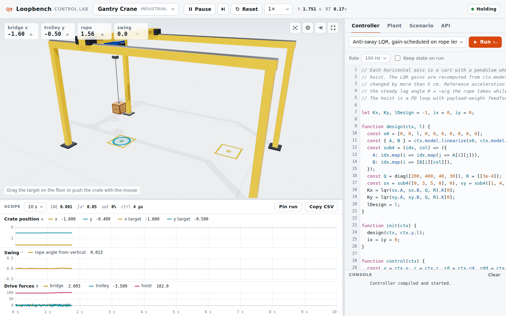
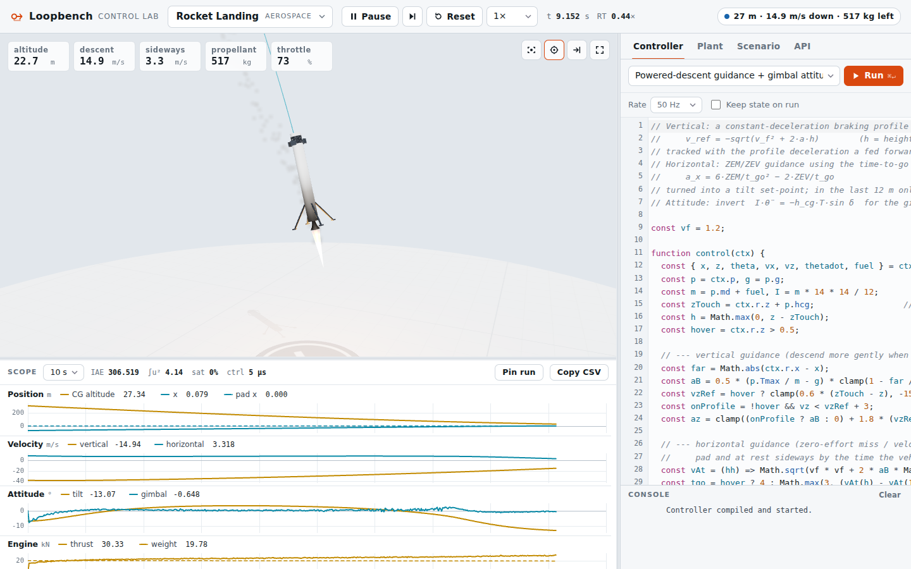

# Loopbench

[](https://github.com/umutcnkus/loopbench/actions/workflows/pages.yml)

A 3D control-systems lab that runs in the browser. Twelve physically modeled plants, from a cart-pole to a landing rocket, run in real time while a controller **you write in JavaScript** closes the loop.

**Open it:** https://umutcnkus.github.io/loopbench/



## Systems

| System | What makes it interesting |
| --- | --- |
| Cart-Pole | Underactuated; energy-based swing-up, then LQR balance |
| Ball & Beam | Rolling ball on a beam tilted by a geared DC motor (back-EMF included) |
| Ball & Plate | Two axes with servo dynamics; the ball can roll off the edge |
| Magnetic Levitation | Open-loop unstable; gap-dependent coil inductance |
| Rotary Pendulum | Furuta pendulum with QUBE-Servo-like parameters |
| Balancing Robot | Two-wheeled, nonholonomic (Kane's method), steerable |
| Robot Arm | Two links under gravity; computed torque, impedance, PID |
| Gantry Crane | 3D swinging payload on a hoist; anti-sway control |
| Quadrotor | 6-DOF rigid body, rotor dynamics, wind and ground contact |
| Double Pendulum | Double inverted pendulum on a cart; LQR and LQG |
| Rocket Landing | Gimballed engine, minimum throttle, propellant burn-off, landing legs |
| Satellite Attitude | Reaction wheels with momentum limits plus thrusters |

Each system comes with 3–5 controller templates to start from, a linearized model, and scenarios with noise, delays and disturbances.

## Writing a controller

```js
// Sliders under the editor; values change live while the simulation runs.
const w = tunable({ qth: [80, 0.1, 1000, 'log'], r: [0.06, 0.001, 10, 'log'] });
let K;

// Runs once after every reset.
function init(ctx) {
  const { A, B } = ctx.model.linearize();
  K = lqr(A, B, diag([30, w.qth, 3, 4]), [[w.r]]).K[0];
}

// Runs every ctx.dt seconds (zero-order hold). Return one number per actuator.
function control(ctx) {
  const { x, theta, xdot, thetadot } = ctx.y;
  return -dot(K, [x - ctx.r.x, wrapAngle(theta), xdot, thetadot]);
}

// Optional: runs right after a slider moves.
function onTune(ctx) {
  init(ctx);
}
```

`ctx` carries the measurements (`ctx.y`), the reference and its derivatives (`ctx.r`, `ctx.rd`, `ctx.rdd`), the model parameters (`ctx.p`) and the nominal model (`ctx.model.f`, `ctx.model.linearize()`). `ctx.log(name, value)` plots any signal. The library includes `lqr`, `dlqr`, `lqe`, `dlqe`, `place`, `c2d`, `eig`, matrix helpers, `PID`, filters, a Kalman filter and quaternion helpers. The API tab in the app lists all of it.

## How it's simulated

- The plant integrates with fixed-step RK4 (0.25–2 ms) in a Web Worker. Your controller is sampled at its own rate with a zero-order hold.
- Sensors have noise, quantization and optional delay. Actuators have saturation, optional lag and delay. Random gusts and pushes are available, and you can drag bodies with the mouse.
- Models come from Lagrangian mechanics, Kane's method or full rigid-body equations. Their equations of motion are shown in the Plant tab. `test/` checks energy or momentum conservation for every model.



## Development

```sh
npm ci
npm run build    # site/index.html (standalone page) and dist/loopbench.html (embeddable fragment)
npm run serve    # http://localhost:8080
npm test         # library, physics and conservation tests
```

| Folder | Contents |
| --- | --- |
| `src/plants` | Plant models: parameters, dynamics, sensors, scenarios |
| `src/controllers` | Controller templates, one file each |
| `src/core` | Simulation engine, linear algebra and control-design library |
| `src/worker` | The Web Worker that runs the plant and your controller |
| `src/app` | UI, scope, editor and the three.js scenes |
| `tools` | Build, code generation, local server and headless-browser checks |

Every push to `main` builds and deploys the site through GitHub Actions (`.github/workflows/pages.yml`).
